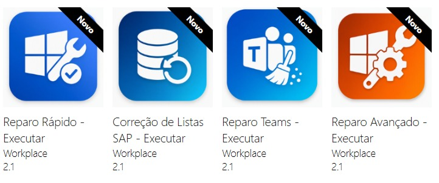

# Workplace Automation Platform

Ferramentas de automação baseadas em PowerShell desenvolvidas para simplificar operações recorrentes de suporte ao Workplace, padronizar procedimentos de troubleshooting e reduzir intervenções manuais.

## Sobre

A **Workplace Automation Platform (WAP)** é uma iniciativa de automação focada na melhoria de processos técnicos e repetitivos de suporte por meio de PowerShell e tecnologias de distribuição corporativa.

As ferramentas foram originalmente desenvolvidas como parte de uma **plataforma corporativa de automação para Workplace** e posteriormente adaptadas para funcionar de forma independente do ambiente corporativo original.

O repositório atual contém as três primeiras ferramentas de automação desenvolvidas para a plataforma.

O projeto foi concebido pensando em ambientes corporativos, incluindo distribuição centralizada por meio do **Microsoft Configuration Manager (SCCM)** e geração estruturada de logs de execução.

---

## Objetivos

A plataforma foi criada para solucionar cenários recorrentes de suporte que tradicionalmente exigem intervenção manual.

### Principais objetivos

* Reduzir tarefas técnicas repetitivas
* Diminuir o tempo necessário para troubleshooting
* Padronizar procedimentos de suporte
* Melhorar a escalabilidade operacional
* Aumentar a produtividade da equipe de Workplace
* Disponibilizar rotinas consistentes de diagnóstico e reparo
* Permitir distribuição centralizada por meio do SCCM
* Coletar dados de execução para análise operacional

---

## Ferramentas Disponíveis

### 1. Teams Repair

Automatiza procedimentos comuns de troubleshooting do Microsoft Teams.

O script realiza:

* Encerramento de processos do Teams
* Encerramento de processos do Microsoft Edge WebView
* Limpeza do cache do Teams
* Múltiplas tentativas de limpeza com lógica de retry
* Reinicialização do aplicativo Teams
* Geração de logs de execução
* Categorização de erros
* Identificação do usuário e da estação de trabalho
* Consulta opcional ao departamento do usuário no Active Directory

**Status:** Produção

---

### 2. Windows Quick Repair

Executa um conjunto de procedimentos rápidos de troubleshooting e manutenção do Windows, utilizados frequentemente no suporte diário de Workplace.

A automação inclui:

* Limpeza do cache DNS
* Reset do Winsock
* Reset do TCP/IP
* Limpeza da pasta TEMP do usuário
* Limpeza da pasta TEMP do Windows
* Limpeza do cache do Teams
* Reinicialização do Windows Explorer
* Coleta de informações do sistema
* Geração de logs de execução
* Tratamento e categorização de erros

**Status:** Produção

---

### 3. Windows Advanced Repair

Disponibiliza uma rotina mais completa de troubleshooting e reparo do Windows para problemas recorrentes do sistema operacional.

A automação inclui procedimentos como:

* System File Checker (SFC)
* Restauração da integridade do sistema com DISM
* Verificação de disco com CHKDSK
* Otimização do disco
* Reset dos serviços do Windows Update
* Limpeza do cache do Windows Update
* Diagnóstico do sistema
* Coleta de informações de rede
* Monitoramento de espaço disponível em disco
* Coleta do tempo de atividade do sistema
* Geração de logs de execução
* Categorização de erros
* Identificação do usuário e da estação de trabalho

**Status:** Produção

---

## Arquitetura

As ferramentas seguem um fluxo simples de automação e telemetria:

```text
┌──────────────────────┐
│   Ferramenta         │
│     PowerShell       │
└──────────┬───────────┘
           │
           ▼
┌──────────────────────┐
│ Troubleshooting &    │
│ Lógica de Reparo     │
└──────────┬───────────┘
           │
           ├──────────────► Logs Locais
           │
           ▼
┌──────────────────────┐
│ Telemetria de        │
│ Execução JSON / CSV  │
└──────────┬───────────┘
           │
           ▼
┌──────────────────────┐
│      Power BI        │
│  Dados Operacionais  │
└──────────────────────┘
```

A arquitetura foi projetada para permitir que a camada de automação execute de forma independente, enquanto gera informações estruturadas que podem posteriormente ser consumidas por soluções de relatórios e análise de dados.

---

## Distribuição Corporativa

Os scripts foram desenvolvidos considerando a distribuição por meio do **Microsoft Configuration Manager (SCCM)**.

Isso permite que as ferramentas sejam distribuídas centralmente e executadas em endpoints Windows gerenciados, sem a necessidade de instalação manual em cada máquina.

### Conceito de distribuição

```text
SCCM

 │
 ├── Teams Repair
 │
 ├── Windows Quick Repair
 │
 └── Windows Advanced Repair
          │
          ▼
    Windows Endpoint
          │
          ├── Reparo
          ├── Logging
          └── Telemetria
```

Essa abordagem transforma scripts individuais de PowerShell em recursos de suporte reutilizáveis dentro de um ambiente corporativo de Workplace.

---

## Distribuição via SCCM

As ferramentas de automação foram projetadas para serem distribuídas pelo **Microsoft Configuration Manager (SCCM)**, permitindo que as equipes de Workplace distribuam e executem rotinas padronizadas de troubleshooting em endpoints Windows gerenciados.

### Ferramentas distribuídas pelo SCCM



A imagem representa a distribuição interna das ferramentas de automação da WAP por meio do SCCM.

O ambiente e os detalhes de infraestrutura originais foram omitidos ou anonimizados por questões de segurança e privacidade.

---

## Logging e Telemetria

Cada automação gera informações de execução para apoiar troubleshooting, auditoria e análise operacional.

As informações coletadas podem incluir:

* Data e horário da execução
* Usuário conectado
* Nome do computador
* Endereço IPv4
* Departamento
* Espaço disponível em disco
* Tempo de atividade do sistema
* Status da execução
* Mensagem de erro
* Categoria do erro
* Duração da execução
* Quantidade de tentativas

A camada de telemetria foi projetada para alimentar futuramente o dashboard da WAP.

### Fluxo de dados planejado

```text
PowerShell
     │
     ▼
   JSON
     │
     ▼
    CSV
     │
     ▼
 Power BI
```

Isso permite que a automação técnica gere dados operacionais mensuráveis, em vez de apenas executar uma rotina de reparo.

---

## Tecnologias

* PowerShell
* Windows Enterprise
* Microsoft Configuration Manager (SCCM)
* Active Directory
* Power BI
* JSON
* CSV
* Git
* GitHub

---

## Roadmap do Projeto

### Concluído

* [x] Teams Repair
* [x] Windows Quick Repair
* [x] Windows Advanced Repair
* [x] Automação baseada em PowerShell
* [x] Tratamento de erros
* [x] Logging de execução
* [x] Telemetria estruturada
* [x] Execução orientada ao SCCM

### Planejado

* [ ] SAP List Repair
* [ ] Autoconfiguração do DBeaver com SSO
* [ ] Instalador automatizado do Docker (WSL + Ubuntu + Docker)
* [ ] Camada de configuração reutilizável
* [ ] Expansão da documentação
* [ ] Dashboard operacional da WAP
* [ ] Novas ferramentas de automação para Workplace
* [ ] Arquitetura modular
* [ ] Maior compatibilidade entre diferentes ambientes

---

## Versão de Produção e Versão Pública

As ferramentas originais da WAP foram desenvolvidas para solucionar problemas reais e recorrentes dentro de uma operação corporativa de Workplace.

A versão pública deste repositório tem como objetivo demonstrar os conceitos técnicos, a arquitetura de automação e as práticas de desenvolvimento utilizadas na solução, sem expor infraestrutura proprietária ou informações corporativas.

O projeto continua evoluindo de uma solução interna orientada à produção para um conjunto de ferramentas de automação mais modular, reutilizável e adaptável.

---

## Segurança e Privacidade

Este repositório não contém:

* Credenciais corporativas
* Senhas internas
* Chaves privadas
* Segredos de produção
* Endereços de servidores internos
* Informações confidenciais de infraestrutura
* Dados corporativos proprietários

Configurações específicas de cada ambiente devem ser adaptadas antes da utilização dos scripts em outra organização.

---

## Autor

**Vinicius Correia**

Analista com foco em **Workplace, Automação de TI, PowerShell e Infraestrutura Windows**.

O projeto WAP representa um esforço contínuo para transformar procedimentos repetitivos de suporte ao Workplace em soluções de automação padronizadas, escaláveis e mensuráveis.
